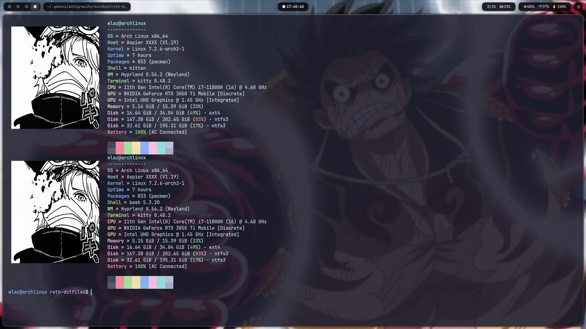

# RETH Dotfiles — Arch Linux & Hyprland Minimalist Setup

[](https://archlinux.org/)
[](https://hyprland.org/)
[](https://github.com/Alexays/Waybar)
[](https://github.com/dzenwertz/Joseph_ICV-Dotfiles)
[](https://github.com/dzenwertz/Joseph_ICV-Dotfiles)
[](https://github.com/dzenwertz)
[](https://opensource.org/licenses/MIT)

<p align="center">
  
</p>

**RETH Dotfiles** is an ultra-minimalist, high-performance desktop suite designed for Arch Linux and Hyprland. Developed by RETH Labs, it combines dark obsidian glass aesthetics, low memory consumption (under 800 MB idle), native 144 Hz Wayland responsiveness, and daily workflow enhancements.

Key highlights include an obsidian pill Waybar, extended audio output (up to 150%), dual wallpaper engine (silent static images via `swaybg` and seamless animated video loops via `mpvpaper`), automatic internal disk mounting without password prompts, and Fastfetch with Kitty Graphics Protocol.

<p align="center">
  
</p>

---

## Navigation / Navegación
- [English Documentation](#english-documentation)
  - [Performance Benchmarks](#performance-benchmarks)
  - [One-Line Installation](#one-line-installation)
  - [Manual Installation](#manual-installation)
  - [Keybindings Cheatsheet](#keybindings-cheatsheet)
  - [Features](#features)
  - [Uninstallation](#uninstallation)
- [Documentación en Español](#documentación-en-español)
  - [Métricas de Rendimiento](#métricas-de-rendimiento)
  - [Instalación en un solo comando](#instalación-en-un-solo-comando)
  - [Instalación Manual](#instalación-manual)
  - [Tabla de Atajos de Teclado](#tabla-de-atajos-de-teclado)
  - [Características](#características)
  - [Desinstalación](#desinstalación)

---

# English Documentation

## Performance Benchmarks

Engineered specifically for low latency, zero background bloat, and battery preservation on modern Intel/NVIDIA laptops:

| Metric | Measured Value | Notes |
| :--- | :--- | :--- |
| **Idle RAM Usage** | `650 MB - 850 MB` | Clean boot with Hyprland, Waybar, Mako, and wallpaper daemon |
| **Idle CPU Utilization** | `< 1%` | True hardware sleep states when idle |
| **Display Refresh Rate** | `144 Hz Native` | Tear-free Wayland synchronization with eDP-1 and external monitors |
| **Audio Over-Extension** | `Up to 150%` | Hardware sink boost calibrated through PipeWire / WirePlumber |
| **Theme Aesthetic** | `Obsidian Dark Glass` | Cohesive palette across borders, status bar, and Kitty terminal |

---

## One-Line Installation

Run the following command in your terminal to automatically install dependencies, back up existing configurations, and apply RETH Dotfiles:

```bash
curl -sSL https://raw.githubusercontent.com/dzenwertz/Joseph_ICV-Dotfiles/main/install.sh | bash
```

## Manual Installation

```bash
git clone https://github.com/dzenwertz/Joseph_ICV-Dotfiles.git
cd Joseph_ICV-Dotfiles
chmod +x install.sh
./install.sh
```

> **Note:** Existing user configurations in `~/.config/{hypr,waybar,fastfetch,kitty,wofi}` are automatically preserved inside `~/.config/reth_dotfiles_backup_<timestamp>/`.

---

## Keybindings Cheatsheet

### Core Applications
| Shortcut | Action | Description |
| :--- | :--- | :--- |
| <kbd>Super</kbd> + <kbd>Return</kbd> | Terminal | Opens Kitty with Fastfetch manga branding |
| <kbd>Super</kbd> + <kbd>Space</kbd> | Application Menu | Opens centered Wofi launcher |
| <kbd>Super</kbd> + <kbd>D</kbd> | Application Menu | Secondary binding for Wofi |
| <kbd>Super</kbd> + <kbd>E</kbd> | File Manager | Opens Nautilus file manager |
| <kbd>Super</kbd> + <kbd>Q</kbd> | Close Window | Closes currently focused window |
| <kbd>Super</kbd> + <kbd>F</kbd> | Fullscreen | Toggles true fullscreen mode |
| <kbd>Super</kbd> + <kbd>V</kbd> | Floating | Toggles window between floating and tiled |

### Wallpaper & Screenshots
| Shortcut | Action | Description |
| :--- | :--- | :--- |
| <kbd>Super</kbd> + <kbd>W</kbd> | Random Wallpaper | Cycles through static and animated wallpapers silently |
| <kbd>Print</kbd> | Screenshot Area | Area capture copied directly to clipboard |
| <kbd>Super</kbd> + <kbd>Shift</kbd> + <kbd>S</kbd> | Screenshot Area | Windows-style area screenshot shortcut |
| <kbd>Super</kbd> + <kbd>Print</kbd> | Full Screenshot | Captures full display and copies to clipboard |
| <kbd>Super</kbd> + <kbd>B</kbd> | Reload Waybar | Restarts Waybar instance safely |
| <kbd>Super</kbd> + <kbd>M</kbd> | Exit Session | Exits Hyprland compositor session |

---

## Features

- **Hyprland Compositor:** Precision tiled layout with graphite/black borders (`rgba(6c7086ee)`), custom 144 Hz display profile, and smooth animations.
- **Obsidian Waybar:** Transparent dark glass bar featuring workspace icons, window titles, live CPU/RAM metrics (one-click `btop` trigger), audio level with 150% boost, Wi-Fi status, battery telemetry, and power menu.
- **Dual Wallpaper Engine:** Intelligently detects file extensions: static files (`.png`, `.jpg`, `.webp`) are managed via `swaybg`; animated videos (`.mp4`, `.webm`) run hardware-accelerated loops via `mpvpaper` with automatic pause on fullscreen windows.
- **Kitty Terminal & Fastfetch:** Translucent Catppuccin Mocha theme configured with high-resolution manga graphics using the Kitty Graphics Protocol.
- **Polkit Automation:** Silent mounting permissions for internal BitLocker/NTFS partitions without repeated root password requests.

---

## Uninstallation

To remove RETH Dotfiles and restore your previous configuration backup:
```bash
curl -sSL https://raw.githubusercontent.com/dzenwertz/Joseph_ICV-Dotfiles/main/uninstall.sh | bash
```

---

# Documentación en Español

## Métricas de Rendimiento

Configurado meticulosamente para máxima fluidez, latencia mínima y preservación de batería en laptops gaming con gráficos híbridos Intel/NVIDIA:

| Métrica | Valor Medido | Observaciones |
| :--- | :--- | :--- |
| **Consumo de RAM en Reposo** | `650 MB - 850 MB` | Inicio limpio con Hyprland, Waybar, Mako y motor de fondos |
| **Uso de CPU en Reposo** | `< 1%` | Estado de suspensión de hardware sin procesos en bucle |
| **Tasa de Refresco** | `144 Hz Nativo` | Sincronización perfecta sin tearing en Wayland (panel eDP-1) |
| **Sobre-extensión de Volumen** | `Hasta 150%` | Ganancia de audio calibrada a través de PipeWire / WirePlumber |
| **Línea Estética** | `Obsidian Dark Glass` | Paleta coherente en bordes de ventana, barra superior y Kitty |

---

## Instalación en un solo comando

Ejecuta el siguiente comando en tu terminal para instalar dependencias, respaldar tus archivos actuales y desplegar RETH Dotfiles automáticamente:

```bash
curl -sSL https://raw.githubusercontent.com/dzenwertz/Joseph_ICV-Dotfiles/main/install.sh | bash
```

## Instalación Manual

```bash
git clone https://github.com/dzenwertz/Joseph_ICV-Dotfiles.git
cd Joseph_ICV-Dotfiles
chmod +x install.sh
./install.sh
```

> **Aviso:** Todas tus configuraciones anteriores en `~/.config/` se respaldan automáticamente en `~/.config/reth_dotfiles_backup_<timestamp>/`.

---

## Tabla de Atajos de Teclado

### Aplicaciones Principales
| Atajo | Acción | Descripción |
| :--- | :--- | :--- |
| <kbd>Super</kbd> + <kbd>Return</kbd> | Terminal | Abre Kitty con Fastfetch y arte manga |
| <kbd>Super</kbd> + <kbd>Espacio</kbd> | Menú de Aplicaciones | Abre el lanzador centrado Wofi |
| <kbd>Super</kbd> + <kbd>D</kbd> | Menú de Aplicaciones | Atajo secundario para Wofi |
| <kbd>Super</kbd> + <kbd>E</kbd> | Explorador de Archivos | Abre Nautilus |
| <kbd>Super</kbd> + <kbd>Q</kbd> | Cerrar Ventana | Cierra la ventana activa actual |
| <kbd>Super</kbd> + <kbd>F</kbd> | Pantalla Completa | Alterna modo pantalla completa |
| <kbd>Super</kbd> + <kbd>V</kbd> | Flotante | Alterna entre ventana flotante y mosaico |

### Fondos y Capturas de Pantalla
| Atajo | Acción | Descripción |
| :--- | :--- | :--- |
| <kbd>Super</kbd> + <kbd>W</kbd> | Cambiar Fondo | Alterna aleatoriamente entre fondos estáticos y animados en silencio |
| <kbd>Impr Pant</kbd> | Captura de Área | Selecciona un área y la copia directamente al portapapeles |
| <kbd>Super</kbd> + <kbd>Shift</kbd> + <kbd>S</kbd> | Captura de Área | Atajo estilo Windows para seleccionar área |
| <kbd>Super</kbd> + <kbd>Impr Pant</kbd> | Captura Completa | Captura toda la pantalla al portapapeles |
| <kbd>Super</kbd> + <kbd>B</kbd> | Recargar Waybar | Reinicia la barra Waybar sin reiniciar sesión |
| <kbd>Super</kbd> + <kbd>M</kbd> | Salir de Sesión | Cierra la sesión de Hyprland |

---

## Características

- **Entorno Hyprland:** Distribución tipo mosaico con bordes grafito oscuro (`rgba(6c7086ee)`), perfil a 144 Hz y animaciones fluidas sin caídas de cuadros.
- **Waybar Obsidian Glass:** Barra flotante oscura con iconos de espacios de trabajo, título de ventana, métricas de CPU/RAM (clic para abrir `btop`), volumen con sobre-extensión al 150%, red, batería y menú de energía.
- **Motor Dual de Wallpapers:** Detección automática por extensión: imágenes estáticas (`.png`, `.jpg`, `.webp`) gestionadas por `swaybg`; videos animados (`.mp4`, `.webm`) reproducidos con aceleración GPU por `mpvpaper` y pausa automática al maximizar ventanas.
- **Terminal Kitty & Fastfetch:** Tema Catppuccin Mocha translúcido con integración de gráficos de alta resolución mediante Kitty Graphics Protocol.
- **Montaje Polkit Silencioso:** Permisos para montar discos internos BitLocker/NTFS sin solicitud continua de clave root.

---

## Desinstalación

Para desinstalar RETH Dotfiles y restaurar tu respaldo previo:
```bash
curl -sSL https://raw.githubusercontent.com/dzenwertz/Joseph_ICV-Dotfiles/main/uninstall.sh | bash
```

---

## Autor & Licencia
- **Marca:** [RETH](https://github.com/dzenwertz)
- **Desarrollador:** Joseph ([@dzenwertz](https://github.com/dzenwertz)) — RETH Labs
- **Licencia:** MIT License
